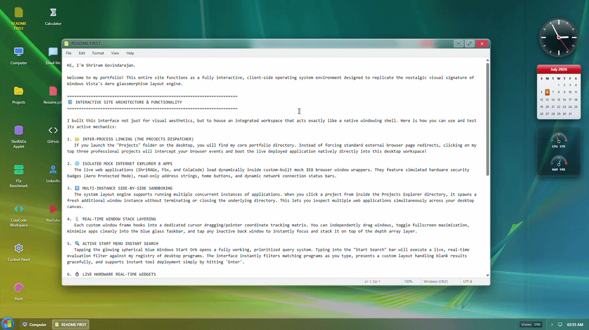

# Windows Vista Aero Portfolio

A nostalgic, high-fidelity recreation of the Windows Vista "Aero" interface, built as a personal portfolio. This project leverages modern web technologies to simulate a fully functional desktop environment, complete with translucent glass effects, fluid window transitions, live embedded applets, and reactive widget structures.

## Live Demo
[https://shriram.is-a.dev](https://shriram.is-a.dev) 

## 🌟 Features

- **Aero Glass UI**: Authentically recreated glassmorphism using Tailwind CSS and backdrop filters, mimicking the classic Windows Vista aesthetic. Includes smooth opening/closing transitions and delayed window cleanup states.
- **Advanced Window Management System**: 
  - Draggable, resizable, and stackable windows with viewport boundary constraints.
  - **Realistic Minimize/Restore Inertia**: Slower, realistic transitions (500ms) utilizing high-performance cubic-bezier interpolation (`ease-[cubic-bezier(0.25,0.8,0.15,1)]`). Minimizing drops windows down into the taskbar (`translate-y-[100vh]`), while closing triggers a soft in-place scale-down fade (`scale-95`).
  - **Native Taskbar Navigation**: Directly mirrors classic Windows behavior where clicking an active taskbar button minimizes the app, and clicking an inactive/minimized window restores and brings it to active z-index focus.
  - **Multi-Instance Workspace**: Integrates a global event bus that lets the **Projects Explorer** dynamically spawn multiple separate live applets concurrently side-by-side on the desktop canvas without closing or displacing the parent folder view.
- **Internet Explorer 8 Emulator**: Deployed live apps (**ShriRAGx**, **FSx**, and **ColaCode**) boot natively inside custom mock IE8 browser window shells. Includes:
  - Simulated green-lit hardware "Aero Protected Mode" security badges.
  - Read-only address bar fields and instant-refresh tools.
  - Tab bar layouts showing home page navigation indexes.
  - Dynamic network connection and protected status bars.
- **Adaptive Viewport Scaling Matrix**: Combines a `ResizeObserver` with translation matrices to solve the iframe responsive dilemma. 
  - On **Desktop** screens, large web apps are displayed as full-size desktop layouts (1280px virtual width) and downscaled gracefully using CSS scale transforms to fit your window boundaries.
  - If a window is resized below a mobile threshold of 640px, the scale overrides are bypassed, enabling the true, native responsive mobile layout of the embedded web application automatically.
- **Active Start Menu Instant Search**: A fully functional, prioritized query system built into the classic Start Orb panel. Typing filters the program database in real-time, displays an elegant fallback state for zero-matches, and supports instant launching via the `Enter` key.
- **Windows Sidebar (Gadget Gallery)**: 
  - Recreated the iconic translucent side panel with hover-triggered deep glass effects.
  - **Analog Clock**: Real-time ticking clock with authentic Vista dial styling and light reflections.
  - **Calendar**: Signature red-header calendar dynamically highlighting the current date.
  - **Resource Meter**: Simulated CPU and RAM usage gauge with animated SVGs and drop-shadow needles.
- **Functional Retro Mini-Apps**:
  - **My Computer (About Me)**: A customized profile card featuring system information, a profile picture, and CV download links.
  - **Paint**: A fully functional canvas-based drawing application with color selection and brush controls.
  - **Calculator**: A working arithmetic calculator with basic operations.
  - **Notepad (README)**: A classic text-editor view detailing system features, retro-dev credits, and personal interests.
  - **Control Panel**: A categorized view of educational background and technical skills.

## 🚀 Technologies Used

- **React**: Component-based architecture for the OS state, hooks, and lifecycle management.
- **Tailwind CSS**: Custom utility classes for "Aero" glass highlights, animations, and layouts.
- **Lucide React**: Vector library powering desktop system icons and mock browser control items.
- **Vite**: Ultra-fast frontend bundler and deployment architecture.

## 🗺️ Future Ideas & Roadmap

- **Global Language Switcher**: Add dynamic internationalization (i18n) to toggle the entire OS interface between English (EN) and German (DE).
- **Theme Integration**: Introduce Dark and Light mode toggles (e.g., an "Aero Night" aesthetic) adapting to user system preferences.
- **Codebase Refactoring**: Break down the monolithic `App.jsx` architecture into smaller, modular component files and context providers for enhanced maintainability and scalability.
- **Free-Scaling Window Borders**: Implementing free-scaling window borders with a custom `ResizeObserver` to allow users to resize windows beyond the current fixed constraints, enabling a more flexible workspace.

## Built with 💙 by Shriram Govindarajan

## Copyright
**Copyright (c) 2026 [Shriram Govindarajan](https://shriram.is-a.dev). All Rights Reserved.**
This repository is available for review purposes only in connection with job applications. No license is granted to use, copy, distribute, or modify this code.